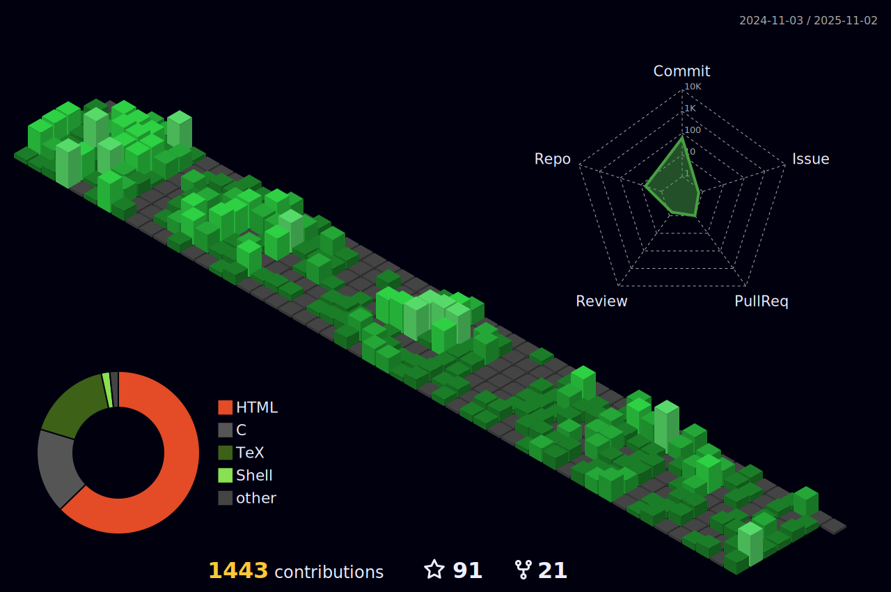

### Hi there! 👋 :maple_leaf:

- 🔭 I’m currently a PhD student at Queen's university. 
- 📫 I can be found mostly via emails, or 

<!--

-->

<!--
**amirsojoodi/amirsojoodi** is a ✨ _special_ ✨ repository because its `README.md` (this file) appears on your GitHub profile.

Here are some ideas to get you started:

- 🔭 I’m currently working on ...
- 🌱 I’m currently learning ...
- 👯 I’m looking to collaborate on ...
- 🤔 I’m looking for help with ...
- 💬 Ask me about ...
- 📫 How to reach me: ...
- 😄 Pronouns: ...
- ⚡ Fun fact: ...

-->
